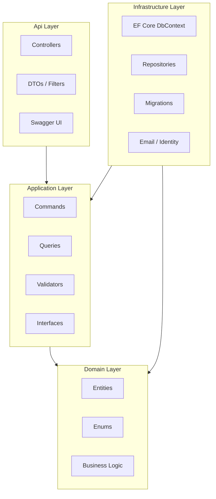
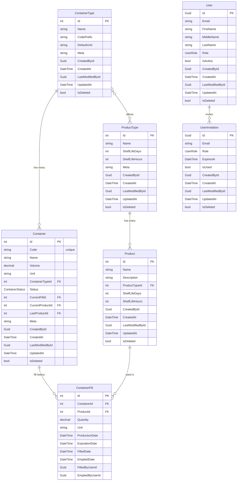
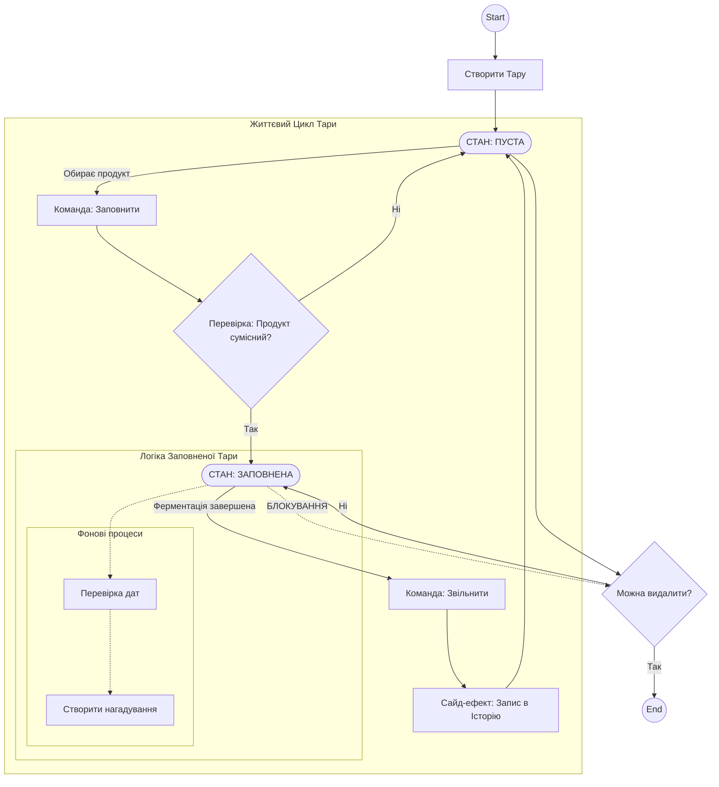
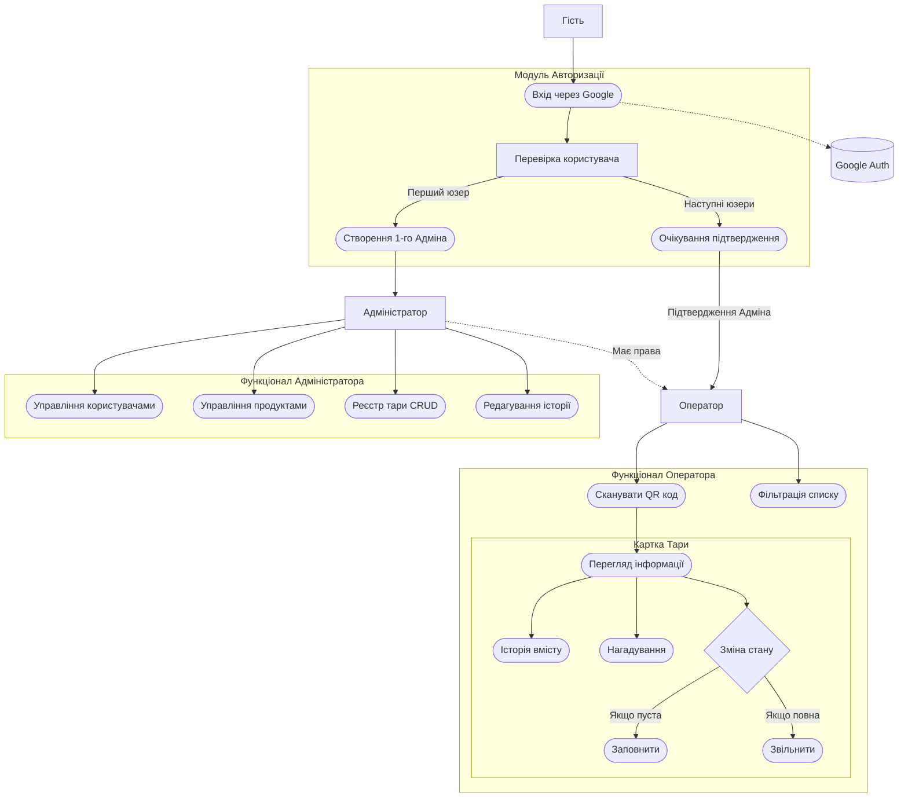

<div align="center">

# 🐱 CATS

### Container Audit Tracking System

[](https://dotnet.microsoft.com/)
[](https://www.postgresql.org/)
[](https://www.docker.com/)
[](LICENSE)

**Система автоматизації обліку, розподілу та відстеження промислової тари**

Повноцінний REST API для управління контейнерами (бочки, каністри, резервуари), їх наповненням продуктами, контролем строків придатності та повною історією операцій.

[Початок роботи](#-початок-роботи) •
[Архітектура](#-архітектура) •
[API Reference](#-api-reference) •
[Swagger UI](#-swagger-ui) •
[Тести](#-тестування)

</div>

---

## 📋 Про проєкт

**CATS** (Container Audit Tracking System) — це бекенд-система для підприємств, що працюють з промисловою тарою. Система вирішує задачу обліку, наповнення, спорожнення та відстеження контейнерів різних типів, наповнених різними продуктами.

### Ключові можливості

| Функція | Опис |
|:---|:---|
| 📦 **Управління контейнерами** | CRUD-операції, пошук за кодом, фільтрація за статусом (`Empty` / `Full`), типом, продуктом, строками |
| 🔄 **Lifecycle-менеджмент** | Наповнення → Оновлення → Спорожнення з повною перевіркою бізнес-правил |
| 📜 **Історія операцій** | Журнал усіх наповнень/спорожнень кожного контейнера з датами та відповідальними |
| 🏷️ **Типи контейнерів** | Налаштування типів тари з кодовими префіксами, одиницями виміру та сумісними продуктами |
| 🧪 **Каталог продуктів** | Ієрархія «Тип продукту → Продукт» зі строками придатності та сумісністю з тарою |
| 👥 **Управління користувачами** | Ролі (Admin / Operator), запрошення через email, Google OAuth2 авторизація |
| 🔍 **Розширений пошук** | Фільтрація контейнерів за строком придатності, датою виробництва, наповненням сьогодні тощо |
| 📧 **Email-запрошення** | Відправка запрошень новим користувачам через SMTP з верифікацією |

### Бізнес-правила

- Контейнер можна наповнити **лише коли він порожній** (`Status = Empty`)
- Продукт перевіряється на **сумісність з типом контейнера** перед наповненням
- Кількість продукту **не може перевищувати об'єм** контейнера
- Одиниці виміру продукту повинні **збігатися** з одиницями контейнера
- Кожне наповнення/спорожнення фіксує **відповідального користувача**
- Строки придатності продукту **наслідуються** від типу продукту, якщо не вказані явно

---

## 🚀 Технологічний стек

```
Backend          .NET 9 (C#), ASP.NET Core Minimal Hosting
Архітектура      Clean Architecture (Domain → Application → Infrastructure → Api)
Паттерни         CQRS (MediatR), Repository, Factory Method
Валідація        FluentValidation
База даних       PostgreSQL 15 (Alpine)
ORM              Entity Framework Core 9 (Code-First + Migrations)
Автентифікація   Google OAuth2 / JWT Bearer tokens
Авторизація      Policy-based ("MustBeActive"), Role-based (Admin/Operator)
Документація     Swagger UI / OpenAPI 3.0 (кастомна Dark/Light тема)
Контейнеризація  Docker (multi-stage build) + Docker Compose
Email            SMTP (Gmail) для запрошень
Тестування       xUnit, Testcontainers (PostgreSQL), WebApplicationFactory
```

---

## 🏗 Архітектура

Проєкт побудований за принципами **Clean Architecture**, де кожен шар має чітку зону відповідальності, а залежності направлені строго всередину.



### Шари додатку

| Шар | Проєкт | Відповідальність |
|:---|:---|:---|
| **Domain** | `src/Domain` | Сутності, бізнес-логіка, перелічення. Не залежить від жодного зовнішнього фреймворку |
| **Application** | `src/Application` | Обробка команд/запитів (CQRS через MediatR), валідація (FluentValidation), інтерфейси |
| **Infrastructure** | `src/Infrastructure` | EF Core DbContext, міграції, репозиторії, email-сервіс, Google Identity |
| **Api** | `src/Api` | REST API контролери, DTOs, конфігурація DI, middleware, Swagger |

### Доменна модель



### Життєвий цикл контейнера (State Machine)

Контейнер проходить через чітко визначені стани — від створення (порожній) через наповнення до спорожнення. Наповнений контейнер **не можна видалити** — спочатку його потрібно спорожнити.



### Потік користувачів та функціональна архітектура

Схема показує як різні ролі (Гість → Оператор → Адміністратор) взаємодіють з системою. Перший зареєстрований користувач стає адміністратором, наступні — потребують підтвердження.



---

## 📖 Початок роботи

### Передумови

| Інструмент | Версія | Призначення |
|:---|:---|:---|
| [Docker Desktop](https://www.docker.com/products/docker-desktop) | 20+ | Контейнеризація БД та API |
| [.NET 9 SDK](https://dotnet.microsoft.com/download/dotnet/9.0) | 9.0+ | Локальна розробка та збірка |
| [JetBrains Rider](https://www.jetbrains.com/rider/) або [Visual Studio](https://visualstudio.microsoft.com/) | Остання | IDE для розробки |
| [Git](https://git-scm.com/) | 2.x+ | Клонування репозиторію |

---

### 🐳 Спосіб 1: Docker (повний стек за 1 команду)

> Піднімає PostgreSQL та API в ізольованих контейнерах. Ідеально для демонстрації та швидкого старту.

```bash
# 1. Клонуйте репозиторій
git clone https://github.com/Hyptofon/CATS.git
cd CATS

# 2. Запустіть всю систему
docker-compose up -d --build

# 3. Відкрийте Swagger UI у браузері
#    👉 http://localhost:5099
```

<details>
<summary>📋 Docker Compose — що запускається?</summary>

| Сервіс | Контейнер | Порт | Опис |
|:---|:---|:---|:---|
| `postgres` | `cats-db` | `5435:5432` | PostgreSQL 15 Alpine з healthcheck |
| `api` | `cats-api` | `5099:8080` | .NET 9 API (чекає на готовність БД) |

Дані PostgreSQL зберігаються у Docker volume `postgres_data` і не зникають при перезапуску контейнерів.

</details>

**Зупинити систему:**
```bash
docker-compose down        # Зупинити контейнери (дані збережені)
docker-compose down -v     # Зупинити + видалити дані БД
```

---

### 👨‍💻 Спосіб 2: Гібридний режим (для розробки)

> PostgreSQL працює в Docker, API запускається локально з IDE — для зручного дебагу та швидкої ітерації.

```bash
# 1. Запустіть тільки базу даних
docker-compose up -d postgres

# 2. Дочекайтесь готовності БД
docker-compose logs -f postgres
#    Чекайте на "database system is ready to accept connections"

# 3. Відкрийте CATS.sln у Rider / Visual Studio

# 4. Переконайтесь, що контейнер cats-api зупинений
docker stop cats-api 2>/dev/null || true

# 5. Запустіть проєкт Api (Run/Debug у IDE)
#    👉 http://localhost:5208
```

> [!IMPORTANT]
> При першому запуску API автоматично застосує всі EF Core міграції та заповнить БД початковими даними (seed).

---

### ⚡ Спосіб 3: Повністю локально (без Docker)

> Потребує встановленого PostgreSQL на машині.

```bash
# 1. Створіть базу даних PostgreSQL
psql -U postgres -c "CREATE DATABASE cats_db;"
psql -U postgres -c "CREATE USER cats_admin WITH PASSWORD 'cats_password_2026';"
psql -U postgres -c "GRANT ALL PRIVILEGES ON DATABASE cats_db TO cats_admin;"

# 2. Оновіть connection string у src/Api/appsettings.Development.json
#    Змініть порт на 5432 (стандартний PostgreSQL)

# 3. Застосуйте міграції
dotnet ef database update --project src/Infrastructure --startup-project src/Api

# 4. Запустіть API
dotnet run --project src/Api
```

---

## 🎨 Swagger UI

Swagger UI у CATS — це не стандартний білий інтерфейс, а **кастомізоване середовище** з темною темою, перемикачем тем та вбудованим інструментом аутентифікації.

### Можливості Swagger UI

| Функція | Опис |
|:---|:---|
| 🌙 **Dark / Light тема** | Кнопка переключення теми в topbar. Вибір зберігається у `localStorage` |
| 🔑 **Auth Tool** | Кнопка `🔑 Auth Tool` в topbar відкриває вбудовану сторінку аутентифікації |
| 🐱 **Кастомний favicon** | Власна іконка замість стандартної Swagger |
| 📖 **XML-документація** | Кожен ендпоінт має детальний опис, параметри та коди відповідей |

### 🔑 Dev Auth Tool (`/dev-auth.html`)

Для зручного тестування API через Swagger без налаштування фронтенду проєкт містить вбудовану сторінку аутентифікації:

```
👉 http://localhost:5208/dev-auth.html   (локальна розробка)
👉 http://localhost:5099/dev-auth.html   (Docker)
```

**Як це працює:**
1. Відкрийте `/dev-auth.html` (або натисніть кнопку `🔑 Auth Tool` у Swagger)
2. Натисніть **"Sign in with Google"**
3. JWT-токен **автоматично скопіюється** в буфер обміну
4. Поверніться до Swagger → натисніть кнопку **Authorize** → вставте токен
5. Тепер усі запити будуть авторизованими ✅

> [!TIP]
> Це повністю замінює потребу у фронтенді для тестування. Якщо ви хочете використовувати фронтенд для верифікації запрошень, налаштуйте параметр `App__FrontendUrl`, або ж просто використовуйте вбудований Dev Auth Tool.

### Місцезнаходження файлів теми

```
src/Api/wwwroot/
├── css/swagger-dark.css    # 🌙 Повна темна тема (221 рядок CSS)
├── js/swagger-custom.js    # ⚡ Перемикач тем + кнопка Auth Tool
├── images/favicon.png      # 🐱 Кастомна іконка
└── dev-auth.html           # 🔑 Google Sign-In → JWT токен генератор
```

---

## ⚙️ Конфігурація середовища

Конфігурація зберігається у `src/Api/appsettings.json` (базова) та `appsettings.Development.json` (для розробки).

### Змінні середовища

| Параметр | Опис | Приклад |
|:---|:---|:---|
| `ConnectionStrings__DefaultConnection` | PostgreSQL connection string | `Host=localhost;Port=5435;Database=cats_db;...` |
| `Authentication__Google__ClientId` | Google OAuth2 Client ID | `288101...googleusercontent.com` |
| `Authentication__Google__ClientSecret` | Google OAuth2 Client Secret | `GOCSPX-...` |
| `EmailSettings__SmtpServer` | SMTP-сервер | `smtp.gmail.com` |
| `EmailSettings__SmtpPort` | SMTP-порт | `587` |
| `EmailSettings__SmtpUsername` | Email для надсилання | `your@email.com` |
| `EmailSettings__SmtpPassword` | Пароль додатку (App Password) | `xxxx xxxx xxxx xxxx` |
| `EmailSettings__SenderName` | Ім'я відправника | `CATS System` |
| `EmailSettings__SenderEmail` | Email відправника | `your@email.com` |
| `App__FrontendUrl` | URL фронтенду для верифікації запрошень _(необов'язковий — можна використовувати вбудований `/dev-auth.html`)_ | `http://localhost:3000/verify-invite` |

> [!TIP]
> Якщо фронтенд не розгорнуто, для авторизації та тестування ви можете повністю покластися на вбудовану сторінку `/dev-auth.html`, що доступна зі Swagger UI.

> [!TIP]
> Для Gmail створіть **App Password** у налаштуваннях Google-акаунта (Google Account → Security → 2-Step Verification → App passwords).

<details>
<summary>🔑 Налаштування Google OAuth2</summary>

1. Перейдіть у [Google Cloud Console](https://console.cloud.google.com/)
2. Створіть новий проєкт або оберіть існуючий
3. Перейдіть у **APIs & Services → Credentials**
4. Натисніть **Create Credentials → OAuth client ID**
5. Тип додатку: **Web application**
6. Додайте Authorized redirect URI: `http://localhost:5208/signin-google`
7. Скопіюйте `Client ID` та `Client Secret` в конфігурацію

</details>

---

## 📡 API Reference

API доступне через **Swagger UI** із кастомною темою при запуску в Development-режимі.

| Режим запуску | Swagger URL | Auth Tool |
|:---|:---|:---|
| Docker Compose | [`http://localhost:5099`](http://localhost:5099) | [`/dev-auth.html`](http://localhost:5099/dev-auth.html) |
| Локальна розробка | [`http://localhost:5208`](http://localhost:5208) | [`/dev-auth.html`](http://localhost:5208/dev-auth.html) |

---

### 📦 Контейнери — `ContainersController`

Управління контейнерами (тарою). Контейнер — це фізична одиниця зберігання (бочка, каністра тощо).
Підтримує CRUD, наповнення/спорожнення, розширений пошук та перегляд повної історії наповнень.

| Метод | Ендпоінт | Опис | Коди відповідей |
|:---|:---|:---|:---|
| `GET` | `/containers` | Отримати список усіх контейнерів з їх поточним станом | `200` |
| `GET` | `/containers/search` | Пошук з фільтрами _(див. параметри нижче)_ | `200` |
| `GET` | `/containers/{id}` | Отримати контейнер за ID | `200` `404` |
| `GET` | `/containers/code/{code}` | Отримати контейнер за унікальним кодом (напр. `МБ-0001`) | `200` `404` |
| `POST` | `/containers` | Створити новий контейнер | `200` `400` `409` |
| `PUT` | `/containers/{id}` | Оновити існуючий контейнер (код змінити не можна) | `200` `404` |
| `DELETE` | `/containers/{id}` | Видалити контейнер (soft delete) | `200` `404` |
| `POST` | `/containers/{id}/fill` | Наповнити контейнер продуктом | `200` `400` `404` |
| `POST` | `/containers/{id}/empty` | Спорожнити контейнер (зберігає запис в історію) | `200` `400` `404` |
| `PUT` | `/containers/{id}/fill` | Оновити дані поточного наповнення (кількість, дати) | `200` `400` `404` |
| `GET` | `/containers/{id}/history` | Повна історія наповнень контейнера (від нових до старих) | `200` |
| `GET` | `/containers/fills/search` | Пошук по історії наповнень усіх контейнерів | `200` |

<details>
<summary>🔍 Параметри пошуку контейнерів — <code>GET /containers/search</code></summary>

Всі параметри передаються через **Query String** і є **необов'язковими**. Можна комбінувати.

| Параметр | Тип | Опис |
|:---|:---|:---|
| `SearchTerm` | `string` | Текстовий пошук за назвою або кодом контейнера |
| `ContainerTypeId` | `int?` | Фільтр по ID типу контейнера |
| `Status` | `ContainerStatus?` | Фільтр по статусу: `Empty` або `Full` |
| `CurrentProductId` | `int?` | Контейнери, наповнені конкретним продуктом |
| `CurrentProductTypeId` | `int?` | Контейнери, наповнені продуктом певного типу |
| `LastProductId` | `int?` | Контейнери, які були наповнені цим продуктом востаннє |
| `ProductionDate` | `DateTime?` | Фільтр за датою виробництва |
| `ShowExpired` | `bool?` | `true` — показати лише протерміновані; `false` — лише непротерміновані |
| `FilledToday` | `bool?` | `true` — показати лише наповнені сьогодні |

**Приклад:**
```http
GET /containers/search?Status=Full&ShowExpired=true&ContainerTypeId=1
```

</details>

<details>
<summary>🔍 Параметри пошуку наповнень — <code>GET /containers/fills/search</code></summary>

| Параметр | Тип | Опис |
|:---|:---|:---|
| `ProductId` | `int?` | Наповнення конкретним продуктом |
| `ProductTypeId` | `int?` | Наповнення продуктом певного типу |
| `ContainerId` | `int?` | Наповнення конкретного контейнера |
| `FromDate` | `DateTime?` | Наповнення з цієї дати |
| `ToDate` | `DateTime?` | Наповнення до цієї дати |
| `OnlyActive` | `bool?` | `true` — лише активні (неспорожнені) наповнення |

</details>

<details>
<summary>📝 Бізнес-правила наповнення (POST /containers/{id}/fill)</summary>

При наповненні контейнера система виконує такі перевірки:

1. ✅ Контейнер повинен бути у статусі `Empty`
2. ✅ Продукт повинен бути сумісним з типом контейнера (через `AllowedProductTypes`)
3. ✅ Кількість не може перевищувати об'єм контейнера
4. ✅ Одиниця виміру (`Unit`) повинна збігатися з контейнером
5. ✅ Фіксується `FilledByUserId` та `FilledDate`

При спорожненні:
- Поточне наповнення закривається (`EmptiedDate`, `EmptiedByUserId`)
- Дані про останній продукт зберігаються в `LastProductId` / `LastProductTypeId`

</details>

---

### 🏷️ Типи контейнерів — `ContainerTypesController`

Управління типами контейнерів (напр. "Металева бочка", "Пластикова каністра"). Тип контейнера визначає кодовий префікс, одиницю виміру за замовчуванням та які типи продуктів можна в нього заливати.

| Метод | Ендпоінт | Опис | Коди відповідей |
|:---|:---|:---|:---|
| `GET` | `/container-types` | Отримати всі типи з їх допустимими типами продуктів | `200` |
| `GET` | `/container-types/{id}` | Отримати тип контейнера за ID | `200` `404` |
| `POST` | `/container-types` | Створити тип контейнера з допустимими типами продуктів | `200` `409` |
| `PUT` | `/container-types/{id}` | Оновити тип контейнера | `200` `404` `409` |
| `DELETE` | `/container-types/{id}` | Видалити тип контейнера | `200` `404` |

<details>
<summary>📋 Приклад body для створення типу контейнера</summary>

```json
{
  "name": "Металева бочка",
  "codePrefix": "МБ",
  "defaultUnit": "л",
  "meta": "Стандартна 200л бочка",
  "allowedProductTypeIds": [1, 2, 3]
}
```

</details>

---

### 🧪 Типи продуктів — `ProductTypesController`

Управління типами продуктів (напр. "Молоко", "Соняшникова олія"). Тип продукту визначає термін придатності за замовчуванням для всіх продуктів цього типу.

| Метод | Ендпоінт | Опис | Коди відповідей |
|:---|:---|:---|:---|
| `GET` | `/product-types` | Отримати всі типи продуктів | `200` |
| `GET` | `/product-types/{id}` | Отримати тип продукту за ID | `200` `404` |
| `POST` | `/product-types` | Створити тип продукту (з строком придатності) | `200` `409` |
| `PUT` | `/product-types/{id}` | Оновити тип продукту | `200` `404` `409` |
| `DELETE` | `/product-types/{id}` | Видалити тип продукту | `200` `404` |

---

### 🍯 Продукти — `ProductsController`

Управління продуктами (напр. "Молоко Галичина 2.5%"). Продукт належить до певного типу продукту і може бути залитий у сумісний контейнер.

| Метод | Ендпоінт | Опис | Коди відповідей |
|:---|:---|:---|:---|
| `GET` | `/products` | Отримати всі продукти з інформацією про тип | `200` |
| `GET` | `/products/search` | Пошук за назвою та/або типом продукту | `200` |
| `GET` | `/products/{id}` | Отримати продукт за ID | `200` `404` |
| `POST` | `/products` | Створити продукт з прив'язкою до типу | `200` `400` `409` |
| `PUT` | `/products/{id}` | Оновити продукт | `200` `404` `409` |
| `DELETE` | `/products/{id}` | Видалити продукт | `200` `404` |

<details>
<summary>🔍 Параметри пошуку продуктів — <code>GET /products/search</code></summary>

| Параметр | Тип | Опис |
|:---|:---|:---|
| `search` | `string?` | Текст для пошуку за назвою (часткове входження) |
| `productTypeId` | `int?` | Фільтр по ID типу продукту |

</details>

---

### 👥 Користувачі — `UsersController`

Управління користувачами системи. **Доступно тільки для адміністраторів** (`[Authorize(Roles = "Admin")]`).

| Метод | Ендпоінт | Опис | Коди відповідей |
|:---|:---|:---|:---|
| `GET` | `/users` | Отримати всіх користувачів з ролями та статусами | `200` |
| `POST` | `/users` | Створити користувача вручну (без запрошення) | `200` `409` |
| `PUT` | `/users/{id}` | Оновити дані користувача (ім'я, роль) | `200` `404` |
| `POST` | `/users/{id}/activate` | Активувати користувача (дозволити доступ) | `200` `404` |
| `POST` | `/users/{id}/deactivate` | Деактивувати користувача (заблокувати доступ) | `200` `404` |

---

### 👤 Профіль — `ProfileController`

Профіль поточного авторизованого користувача. Дозволяє переглядати та оновлювати свої особисті дані.

| Метод | Ендпоінт | Опис | Коди відповідей |
|:---|:---|:---|:---|
| `GET` | `/profile` | Отримати свій профіль (email, ім'я, роль, статус) | `200` `401` |
| `PUT` | `/profile` | Оновити свій профіль (ім'я, по батькові, прізвище) | `200` `401` |

---

### 📧 Запрошення — `InvitationsController`

Управління запрошеннями користувачів. Адміністратор створює запрошення на email, після чого користувач може зареєструватися за посиланням-токеном.

| Метод | Ендпоінт | Опис | Коди відповідей |
|:---|:---|:---|:---|
| `POST` | `/invitations` | Створити запрошення (надіслати email з токеном). Тільки **Admin** | `200` `409` |
| `GET` | `/invitations/verify/{token}` | Перевірити запрошення по GUID-токену | `200` `404` |

---

### 🔐 Test Auth — `TestAuthController`

Діагностичні ендпоінти для перевірки авторизації та ролей. Корисно для тестування без фронтенду.

| Метод | Ендпоінт | Опис | Доступ |
|:---|:---|:---|:---|
| `GET` | `/api/TestAuth/who-am-i` | Показує ваш ID, email, ролі та статус автентифікації | Будь-який авторизований |
| `GET` | `/api/TestAuth/admin-secret` | Тестовий ендпоінт лише для Admin | Тільки Admin |
| `GET` | `/api/TestAuth/operator-zone` | Тестовий ендпоінт для Admin та Operator | Admin, Operator |

---

## 🧪 Тестування

Проєкт використовує **інтеграційні тести**, що тестують повний цикл роботи API endpoint-ів з реальною базою даних (PostgreSQL через Testcontainers).

### Запуск тестів

```bash
# Запустити всі тести
dotnet test

# Запустити з деталізованим виводом
dotnet test --verbosity normal

# Запустити конкретний тест-проєкт
dotnet test tests/Api.Tests.Integration
```

> [!NOTE]
> Тести використовують **Testcontainers** — Docker автоматично піднімає тимчасовий контейнер PostgreSQL. Переконайтесь, що Docker Desktop запущений.

### Структура тестів

```
tests/
├── Api.Tests.Integration/    # Інтеграційні тести API endpoints
│   ├── ContainerTypes/       # Тести CRUD для типів контейнерів
│   ├── Containers/           # Тести контейнерів (CRUD, fill/empty, search)
│   ├── Products/             # Тести продуктів
│   └── ProductTypes/         # Тести типів продуктів
├── Tests.Common/             # Базова інфраструктура тестів
│   ├── IntegrationTestWebFactory.cs   # WebApplicationFactory + Testcontainers
│   └── BaseFakeAuth/                  # Імітація авторизації для тестів
└── Tests.Data/               # Генератори тестових даних
    └── *DataFactory.cs       # Object Mothers / Builders
```

---

## 📂 Структура проєкту

```
CATS/
├── 📄 CATS.sln                    # Solution file
├── 🐳 Dockerfile                  # Multi-stage build (SDK → Runtime)
├── 🐳 docker-compose.yml          # PostgreSQL + API orchestration
│
├── src/
│   ├── Domain/                    # 🧠 Ядро — сутності та бізнес-логіка
│   │   ├── Common/                #    BaseAuditableEntity (audit trail)
│   │   ├── Containers/            #    Container, ContainerFill, ContainerStatus
│   │   ├── ContainerTypes/        #    ContainerType (тип тари)
│   │   ├── Products/              #    Product, ProductType
│   │   └── Entities/              #    User, UserInvitation, UserRole
│   │
│   ├── Application/               # ⚙️ Use Cases — команди, запити, валідація
│   │   ├── Common/                #    Інтерфейси, пайплайни, помилки
│   │   ├── Containers/            #    CreateContainer, FillContainer, SearchContainers...
│   │   ├── ContainerTypes/        #    CRUD команди та запити
│   │   ├── Products/              #    CRUD команди та запити
│   │   ├── ProductTypes/          #    CRUD команди та запити
│   │   ├── Users/                 #    Управління користувачами
│   │   └── Invitations/           #    Відправка та верифікація запрошень
│   │
│   ├── Infrastructure/            # 🔧 Реалізація інфраструктури
│   │   ├── Persistence/           #    ApplicationDbContext, Repositories, Seed
│   │   ├── Migrations/            #    EF Core Code-First міграції
│   │   ├── Identity/              #    Google Claims Transformation
│   │   └── Services/              #    Email Service (SMTP)
│   │
│   └── Api/                       # 🌐 REST API — точка входу
│       ├── Controllers/           #    8 контролерів
│       ├── Dtos/                  #    Request/Response DTOs
│       ├── Filters/               #    Exception filters
│       ├── Modules/               #    DI модулі (CORS, Swagger, Mapping)
│       ├── Converters/            #    JSON converters
│       ├── wwwroot/               #    Swagger тема, Auth Tool, favicon
│       │   ├── css/swagger-dark.css
│       │   ├── js/swagger-custom.js
│       │   ├── dev-auth.html
│       │   └── images/favicon.png
│       └── Program.cs             #    Точка входу, конфігурація, middleware
│
└── tests/                         # 🧪 Тести
    ├── Api.Tests.Integration/     #    Інтеграційні тести з реальною БД
    ├── Tests.Common/              #    WebApplicationFactory, AuthHandler
    └── Tests.Data/                #    Фабрики тестових даних
```

---

## 🔑 Ролі та авторизація

| Роль | Доступ | Опис |
|:---|:---|:---|
| **Admin** | Повний | Управління користувачами, запрошення, повний CRUD, активація/деактивація |
| **Operator** | Обмежений | Робота з контейнерами та продуктами |

- Автентифікація через **Google OAuth2** (JWT Bearer tokens)
- Кастомна трансформація claims: при першому логіні система автоматично створює профіль користувача
- Політика авторизації `MustBeActive` — тільки активні користувачі мають доступ
- Вбудований **Dev Auth Tool** (`/dev-auth.html`) для тестування без фронтенду

---

## 🐳 Docker

### Dockerfile (Multi-stage build)

```
Стадія 1 (build)     → .NET 9 SDK — restore, build
Стадія 2 (publish)   → .NET 9 SDK — publish Release
Стадія 3 (final)     → .NET 9 ASP.NET Runtime — мінімальний образ
```

### Порти

| Сервіс | Внутрішній | Зовнішній |
|:---|:---|:---|
| PostgreSQL | `5432` | `5435` |
| API | `8080` | `5099` |

---

## 🤝 Внесок у проєкт

1. Форкніть репозиторій
2. Створіть feature-гілку (`git checkout -b feature/amazing-feature`)
3. Зробіть commit (`git commit -m 'Add amazing feature'`)
4. Push до гілки (`git push origin feature/amazing-feature`)
5. Відкрийте Pull Request

---

## 📝 Ліцензія

Цей проєкт розповсюджується під ліцензією MIT. Дивіться файл [LICENSE](LICENSE) для деталей.

---

<div align="center">

**Розроблено з ❤️ для автоматизації промислового обліку тари**

[⬆ На початок](#-cats)

</div>
